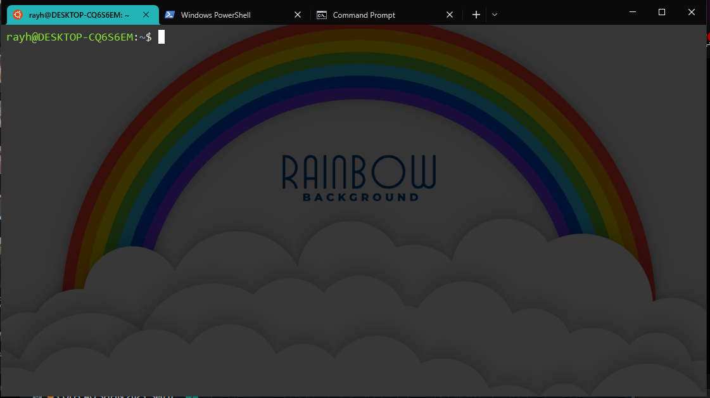
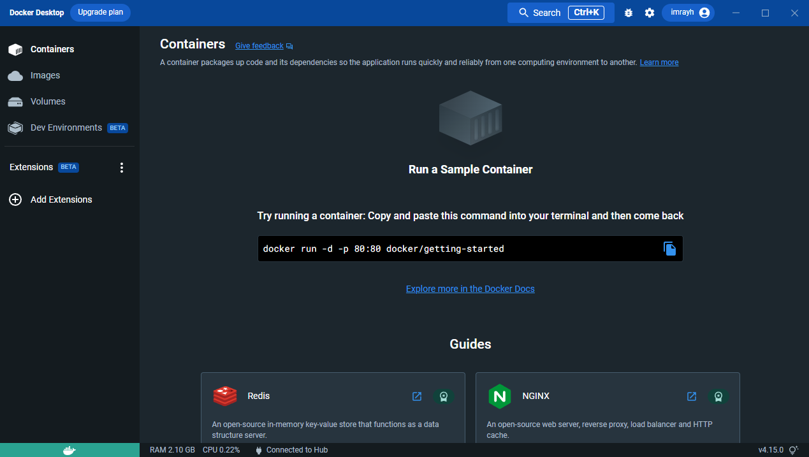

# Configurando um Ambiente básico de desenvolvimento

## ferramentas básicas para desenvolvimento

- #### Linux
- #### Git
- #### Docker
- #### Editor de código

## Dando início
- ### Adquirindo linux
Basicamente não iremos ultilizar de dual boot, vamos usar uma ferramenta um pouco mais elegante iremos ultilizar o WSL
(*windows subsystem for linux*) o que essa ferramenta nos fornece é um sistema linux sem a necessidade de uma máquina virtual,
nós teremos um sistema Linux que compartilha dos mesmos recursos que o windows, isto é, o Linux será executado como um programa nativo
do Windows basicamente.

O tutorial que vai ser aqui descrito pode ser melhor detalhado pelo próprio site da Microsoft que trada do [WSL](https://learn.microsoft.com/pt-br/windows/wsl/install)

Abra o PowerShell do windows em modo de administrador execute o comando para instalar a base para wsl
~~~shell
wsl --install
~~~
Verifique se a versão do wsl instalada é a versão 2, ultilize o comando:
~~~shell
wsl -l -v
~~~

Caso não seja a versão 2, visite a [página oficial da Microsoft](https://learn.microsoft.com/pt-br/windows/wsl/install) 
e atualize para a versão 2.

Tendo a versão 2 instalada continuemos escolhendo alguma das versões disponiveis do Linux
- ### Escolhendo e adquirindo uma versão do linux
Para adquirir uma distribuição do linux basta ir á [loja oficial da Microsoft](https://aka.ms/wslstore) e escolher uma 
da sua preferência. (*para usuários iniciantes recomendo usar a distro do ubuntu por ser a mais usada e de mais fácil manuseio*)

### ou escolha dentres uma dsa distros abaixo:
- [Ubuntu 22.04 LTS](https://www.microsoft.com/store/apps/9PN20MSR04DW)
- [OpenSUSE Leap 15.1](https://www.microsoft.com/store/apps/9NJFZK00FGKV)
- [Kali Linux](https://www.microsoft.com/store/apps/9PKR34TNCV07)
- [Debian](https://www.microsoft.com/store/apps/9MSVKQC78PK6)
- [Fedora](https://www.microsoft.com/store/apps/9n6gdm4k2hnc)
- [Alpine](https://www.microsoft.com/store/apps/9p804crf0395)

Assim que instalado basta abrir o app da sua distribuição, ou executar o comando WSL no seu terminal.
No primeiro acesso será pedido a você que insira um usuário e uma senha, e após isso voce terá um sistema linux em sua máquina,
com todos os comandos do sistema e podendo executar todos os programas por CLI.

Uma dia que achamos válida e instalar o app [Terminal](https://apps.microsoft.com/store/detail/windows-terminal/9N0DX20HK701?hl=pt-br&gl=br)
 ele nos fornece um rapido acesso a todos os terminais em nossa máquina de forma rápida e personalizável.

 E *voilà* ja temos um nosso requisito básico que é o linux.

- ### Git
Com o passo anterior já feito já temos a melhor parte que é ter o git por padrão já instalado na nossa máquina, logo podemos pular esse passo!.

- ### Docker
Agora para finalizar os programas básicos temos um que causa calafrios e arrepios em muitos, nosso **amado** [Docker](https://www.docker.com/)
vamos instalar para ser executado em conjunto com o WSL já instalado esse tutorial vai ser baseado nos seguintes conjunto de tutoriais
[oficiais do Docker](https://docs.docker.com/desktop/windows/wsl/).

#### Baixe o instalador oficial.

[instalador do oficial do docker](https://desktop.docker.com/win/main/amd64/Docker%20Desktop%20Installer.exe)

Assim que baixado e executado será perguntado se ultilizar do docker desktop juntamente com o wsl 2, aceite e siga os passos básicos
de uma instalação padrão do Windows ( *next, next, install* ) e finalizando reinicie a máquina, abrindo o docker novamente
a seguinte tela será apresentada a você:

**Talvez o detalhe me verde no canto esquerdo pode estar em outra cor aguarde instantes em quanto a engine da aplicação inicia.**

Uma segunda dica que passamos é desativar a inicialização automatica do docker já que depedendo da quantidade de containeres
executando os custos de processamento podem ser muito altos e causando lentidão na sua máquina.

#### Seguindo os passos para remover a inicialização altomática
1. use o atalho para o gerenciador de processos: **CTRL + SHIFT + ESC**.
2. caso esteja minimizado localize o botão **mais detalhes**.
3. localize a aba inicialiazação (*startup*).
4. Encontre **'DOCKER DESKTOP'** e desative a inicialização automática.

Terminado isso temos uma máquina com as ferramentas básicas, agora para nós, só resta um editor de código que vai ser o 
nosso próximo passo!

* ### Editor de código

Um ponto a ser debatido agora é que editor de código usar, a resposta como de qualquer outra pessoa é o famoso e queridinho 
VS code (visual studio code) que é sem duvida a melhor ferramenta para programadores iniciantes que estão aprendendo os detalhes de se iniciar
em uma nova linguagem ou novo método de programar, e compartilho dessa visão, posteriormente recomendo as famosas IDE's propriamente ditas, por chegar em pontos
que a performance tem prioridade sob o que um dia foi aprendizado, e dando um pulo nas fases de configurar variaveis do sistema para a nova linguagem,
e mesmo assim o visual studio code nos acompanhará como um bom bloco de notas, o que um dia foi o espaço do notepad++
para os mais vividos no universo 'codigalactical'.

instalar o vs code é bem simples, vá a pagina oficial do visual studio code na loja Microsoft e instale o app

- [site oficial do app](https://code.visualstudio.com/)
- [site do app na loja Microsoft](https://apps.microsoft.com/store/detail/XP9KHM4BK9FZ7Q)

### Finalizando

Terminados esses passos temos um workspace para desenvolvermos programas em qualquer linguagem e para colocarmos em produção.

