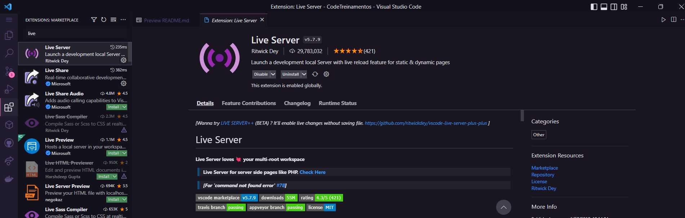
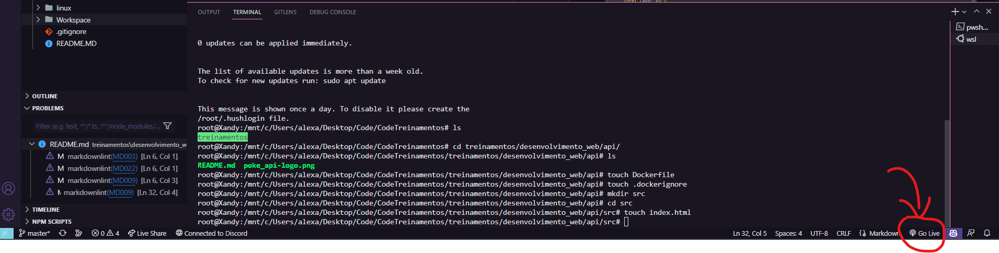
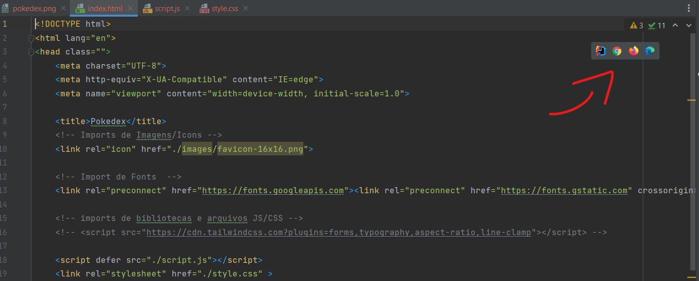

# API

## O que é uma API

API é a sigla para Aplication Programming Interface (Inferface de Programação de Aplicações), seu objetivo e de facilitar o desenvolvimento de aplicações, trata-se de um conjunto de rotinas e padrões muito utilizados na web para facilitar a integração entre diferentes sites e aplicativos. Onde o objetivo é fazer o tratamentos dos dados retornado pela API para se adequar ao contexto utilizado na aplicação.

## Objetivo

Nesse treinamento poderemos observar:

* Finalidade do Uso de API para desenvolvimento
* Visualizar os dados retornado pela API
* Fazer o tratamento desses dados
* Como inserir os dados dentro da Aplicação

## Requisitos para brincar com API's

Ter instalado:

* [Insomnia](https://insomnia.rest/download)  ou [Postman](https://www.postman.com/downloads/)
* Uma IDE de sua preferência

Ter uma extensão para a visualização de páginas HTML:
  
* Para quem usa VS Code: Faça o download da extensão "Live Server".
  
   
    

     Se extensão foi ativada, crie e abra um arquivo HTML e olhe na barra de inferior e veja se apareceu esse icone abaixo do seu console:

   

    

* Caso use outra IDE, como IntelliJ basta abrir um arquivo HTML e selecionar o próprio icone do IntelliJ ou o navegador onde será aberto o preview da pagina HTML:
  
    

## Atividade Prática

Nessa Atividade vamos escrever a função que vai fazer a consulta na API **"POKÉAPI"** e fazer o tratamento dos dados, onde vamos buscar os dados dos Pokémons e inserir na nossa "Pokédex", buscando o **ID, SPRITE e NOME** do Pokémon.

Link para a Documentação da API:

* <https://pokeapi.co>
